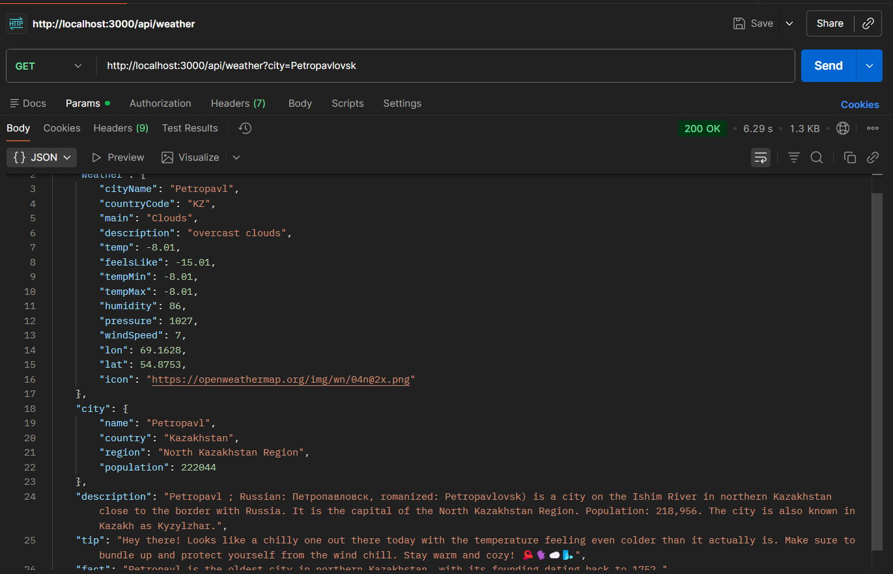
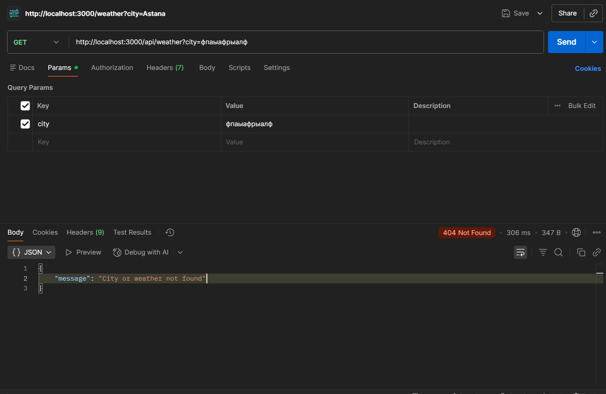
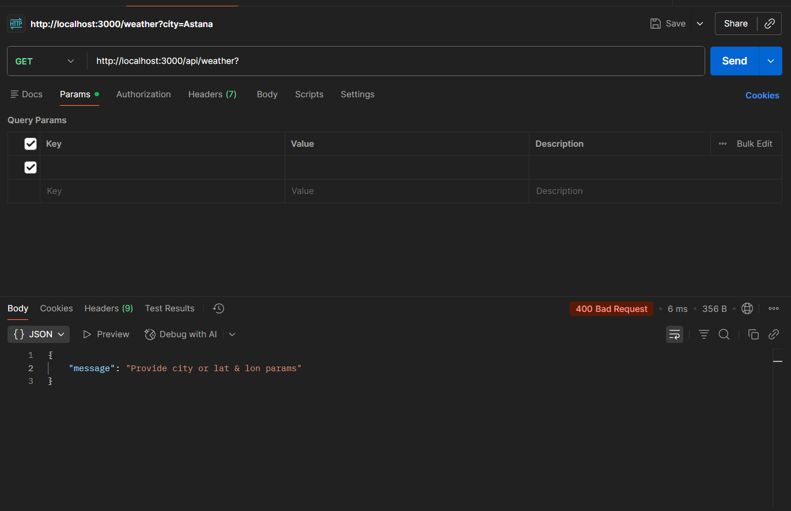
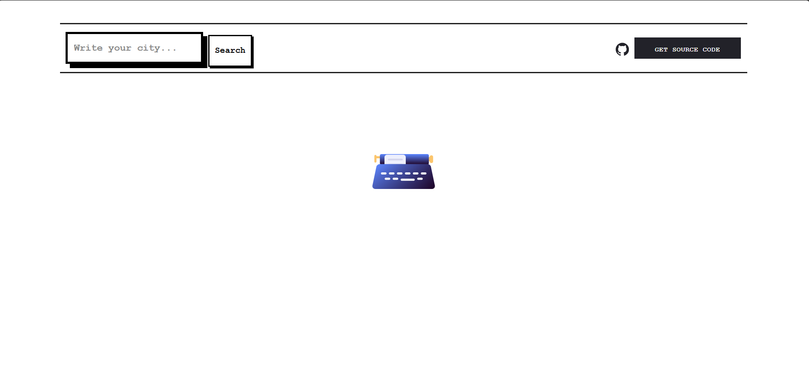
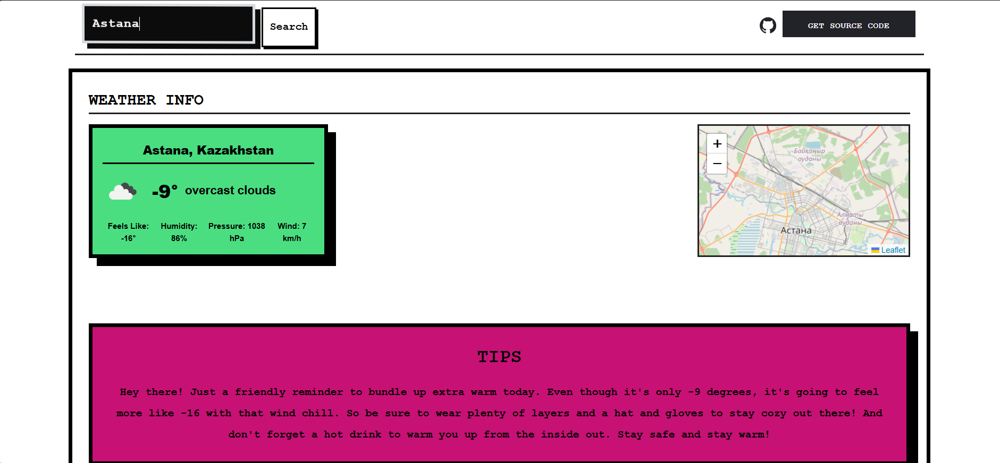
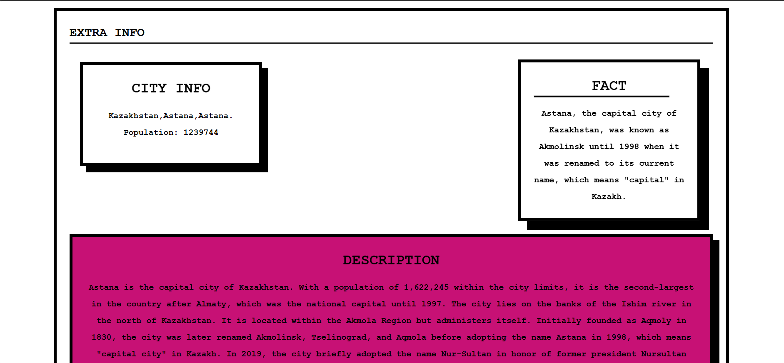

# Quick Start
### Frontend
move into frontend folder and install dependencies 
```bash
cd frontend
npm install
```

next you can run frontend using this command

for dev environment
```bash
npm run dev
```

or you can build application using
```bash
npm run build
```

after this application will be available on [localhost:5173](http://localhost:5173/)

# Backend

move into backend folder and install dependencies using these commands from the project root folder

```bash
cd backend
npm install
```

next you can run backend using this command
```bash
npm start
```

backend will be available on [localhost:3000](http://localhost:3000/)

also be sure that you created .env file with api keys for OpenAI API, GeoDB and OpenWeatherApi. 

Use this naming for environment variables: OPEN_WEATHER_API_KEY, OPENAI_API_KEY, GEO_API_KEY

# Report for assignment

### Postman API tests

1. Success response


2. Not Found response


3. Bad Request response


### Frontend overview





